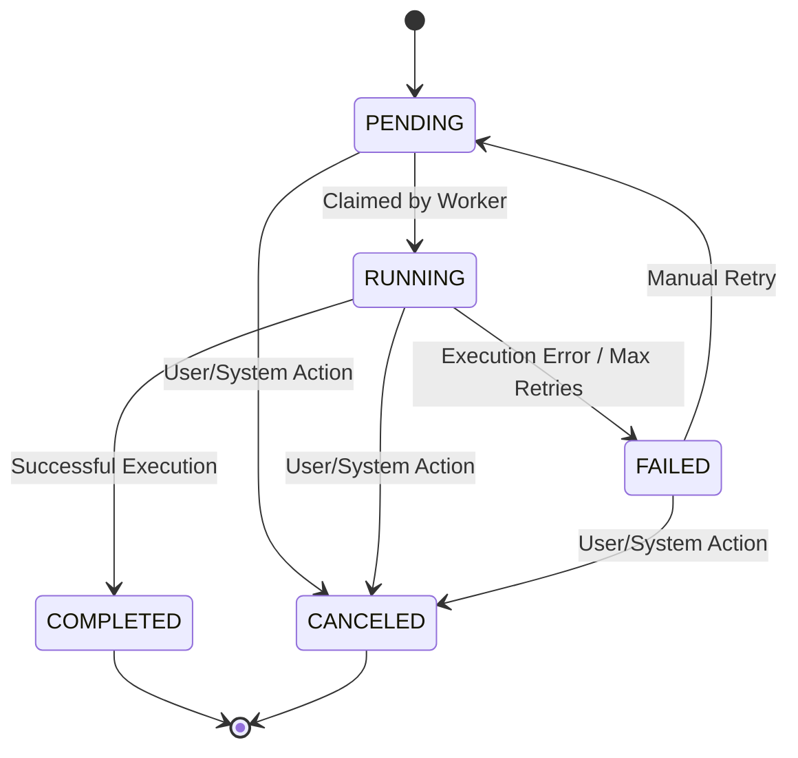
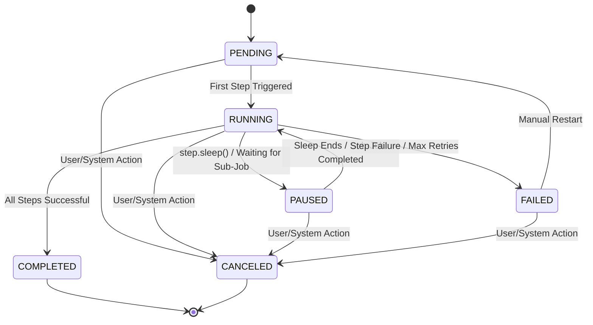

# Zinco: Technical Architecture Document

## Introduction

This document provides a comprehensive technical overview of Zinco, a self-hosted, developer-controlled meta-framework for background jobs and durable workflows. It details the architectural design, component responsibilities, inter-process communication (IPC) mechanisms, data models, and execution flows. Zinco's unique approach combines the high-performance capabilities of **Zig** for its core engine with the developer-friendly productivity of **TypeScript** for its SDK and application-facing components, aiming to deliver a robust, efficient, and fully transparent workflow orchestration solution.

## 1. High-Level Architecture: Zig Core & TypeScript Layer

Zinco's architecture is fundamentally split into two distinct, yet tightly integrated, layers:

*   **Zinco Core (Zig)**: The low-level, high-performance engine responsible for orchestration, scheduling, job claiming, and managing worker processes. Written in Zig for maximum efficiency, minimal resource consumption, and precise control.
*   **Zinco Application Layer (TypeScript)**: The developer-facing components, including the SDK for defining jobs and workflows, the Domain-Specific Language (DSL), and the embeddable dashboard. Written in TypeScript to provide an excellent developer experience (DX), type safety, and seamless integration with modern JavaScript ecosystems.

This hybrid architecture ensures that performance-critical operations are handled by a highly optimized native binary, while the developer interaction remains within a familiar and productive environment.

```mermaid
graph TD
    subgraph User Application (TypeScript)
        A[Zinco SDK] --> B(Job/Workflow Definitions)
        B --> C[Trigger Job/Workflow]
        C --> D[Zinco Dashboard (React Components)]
    end

    subgraph Zinco Core (Zig Binary)
        E[Orchestrator] --> F[Scheduler]
        E --> G[Job Claiming]
        E --> H[Worker Runtime]
        H --> I[IPC (Unix Domain Sockets)]
    end

    subgraph Persistence Layer
        J[PostgreSQL/SQLite] <--> E
        J <--> G
    end

    C -- IPC (UDS) --> E
    I -- IPC (UDS) --> C
    H -- Spawns & Monitors --> K[Node.js/Bun Worker Process]
    K -- Executes --> B
    K -- Reports Status --> I
    D -- Queries --> J
```

## 2. Zinco Core Components (Zig)

The Zinco Core is a single, self-contained Zig binary (`zinco-core`) that can operate in different modes (worker, orchestrator) depending on the deployment configuration. Its primary responsibilities include:

### 2.1. Orchestrator

*   **Role**: The central brain of Zinco, responsible for managing the lifecycle of jobs and workflows.
*   **Key Functions**:
    *   Receives job/workflow trigger requests from the TypeScript SDK via IPC.
    *   Persists job and workflow metadata into the database.
    *   Coordinates with the Scheduler to enqueue jobs for execution.
    *   Monitors job status and manages state transitions.
    *   Handles durable execution logic, including `step.sleep()` and `step.retry()`.

### 2.2. Scheduler

*   **Role**: Manages the timing and order of job execution.
*   **Key Functions**:
    *   Enqueues jobs based on their scheduled time or immediate availability.
    *   Supports cron-based scheduling for recurring tasks.
    *   Prioritizes jobs based on configurable rules.

### 2.3. Job Claiming & Locks

*   **Role**: Ensures that jobs are processed exactly once by a single worker, even in distributed environments.
*   **Key Functions**:
    *   Implements a robust distributed locking mechanism (e.g., using `SELECT FOR UPDATE` in PostgreSQL or atomic operations in Redis).
    *   Workers 
claim jobs from the queue, preventing duplicate processing.
    *   Handles lease management and re-claiming of jobs from failed workers.

### 2.4. Worker Runtime

*   **Role**: Manages the execution of actual job logic written in TypeScript/JavaScript.
*   **Key Functions**:
    *   Spawns and manages isolated Node.js/Bun child processes for each job execution.
    *   Monitors child processes for resource usage (CPU, memory) and unexpected termination.
    *   Communicates with child processes via IPC (Unix Domain Sockets) to send job payloads and receive results/logs.
    *   Ensures graceful shutdown and cleanup of worker processes.

## 3. Inter-Process Communication (IPC): Unix Domain Sockets

Communication between the Zinco Core (Zig) and the Node.js/Bun worker processes, as well as between the SDK and the Core, is primarily facilitated by **Unix Domain Sockets (UDS)**. This choice prioritizes reliability, ease of implementation, and sufficient performance for the majority of use cases.

### 3.1. UDS Protocol Specification

The UDS will implement a custom, lightweight binary protocol. Each message will consist of:

*   **Header**: Fixed-size (e.g., 8 bytes) containing message type (e.g., `TRIGGER_JOB`, `JOB_RESULT`, `LOG_ENTRY`) and payload length.
*   **Payload**: Variable-size, typically JSON-serialized data (e.g., job payload, execution result, log message).

**Example Message Flow (Job Trigger):**

1.  **TypeScript SDK**: Serializes job details (ID, payload, function reference) to JSON.
2.  **TypeScript SDK**: Sends JSON payload via UDS to Zinco Core (Zig).
3.  **Zinco Core (Zig)**: Receives message, deserializes JSON, and persists job to DB.
4.  **Zinco Core (Zig)**: Sends acknowledgment back to SDK via UDS.

### 3.2. Reliability & Error Handling

*   **Connection Management**: The Zig core will manage UDS server sockets, and TypeScript processes will act as clients. Automatic reconnection logic will be implemented for transient disconnections.
*   **Message Queuing**: The operating system kernel handles message buffering for UDS, providing inherent backpressure and preventing message loss under normal operating conditions.
*   **Serialization/Deserialization**: Robust error handling will be implemented for JSON serialization/deserialization to prevent crashes due to malformed data.

## 4. Data Model (PostgreSQL)

Zinco relies on a relational database (PostgreSQL by default) for persistent storage of job and workflow states. The core tables include:

### 4.1. `jobs` Table

Stores metadata and state for individual background jobs.

| Column Name | Data Type | Description | Constraints |
| :--- | :--- | :--- | :--- |
| `id` | UUID | Unique identifier for the job. | Primary Key |
| `workflow_id` | UUID | Optional: ID of the workflow this job belongs to. | Foreign Key to `workflows.id` |
| `name` | TEXT | Name of the job function (e.g., `processVideo`). | NOT NULL |
| `payload` | JSONB | Input data for the job. | NOT NULL |
| `status` | ENUM | Current status: `PENDING`, `RUNNING`, `COMPLETED`, `FAILED`, `CANCELED`. | NOT NULL, Default: `PENDING` |
| `retries_attempted` | INTEGER | Number of retry attempts made. | Default: 0 |
| `max_retries` | INTEGER | Maximum allowed retry attempts. | Default: 0 |
| `scheduled_at` | TIMESTAMP WITH TIME ZONE | When the job is scheduled to run. | NOT NULL |
| `started_at` | TIMESTAMP WITH TIME ZONE | When the job execution started. | NULLABLE |
| `completed_at` | TIMESTAMP WITH TIME ZONE | When the job execution completed. | NULLABLE |
| `error` | JSONB | Error details if the job failed. | NULLABLE |
| `result` | JSONB | Output data if the job completed successfully. | NULLABLE |
| `created_at` | TIMESTAMP WITH TIME ZONE | Timestamp of job creation. | NOT NULL, Default: `NOW()` |
| `updated_at` | TIMESTAMP WITH TIME ZONE | Last update timestamp. | NOT NULL, Default: `NOW()` |
| `locked_by` | TEXT | Identifier of the worker currently processing the job. | NULLABLE |
| `locked_at` | TIMESTAMP WITH TIME ZONE | Timestamp when the job was locked. | NULLABLE |

### 4.2. `workflows` Table

Stores metadata and state for durable workflows.

| Column Name | Data Type | Description | Constraints |
| :--- | :--- | :--- | :--- |
| `id` | UUID | Unique identifier for the workflow. | Primary Key |
| `name` | TEXT | Name of the workflow function (e.g., `userOnboarding`). | NOT NULL |
| `payload` | JSONB | Initial input data for the workflow. | NOT NULL |
| `status` | ENUM | Current status: `PENDING`, `RUNNING`, `COMPLETED`, `FAILED`, `CANCELED`. | NOT NULL, Default: `PENDING` |
| `current_step` | TEXT | ID of the current step being executed. | NULLABLE |
| `context` | JSONB | Workflow-specific context data (e.g., results from previous steps). | NOT NULL, Default: `{}` |
| `created_at` | TIMESTAMP WITH TIME ZONE | Timestamp of workflow creation. | NOT NULL, Default: `NOW()` |
| `updated_at` | TIMESTAMP WITH TIME ZONE | Last update timestamp. | NOT NULL, Default: `NOW()` |

### 4.3. `logs` Table

Stores structured logs generated by jobs and the Zinco Core.

| Column Name | Data Type | Description | Constraints |
| :--- | :--- | :--- | :--- |
| `id` | UUID | Unique identifier for the log entry. | Primary Key |
| `job_id` | UUID | ID of the job this log entry belongs to. | Foreign Key to `jobs.id` |
| `workflow_id` | UUID | Optional: ID of the workflow this log entry belongs to. | Foreign Key to `workflows.id` |
| `level` | ENUM | Log level: `INFO`, `WARN`, `ERROR`, `DEBUG`. | NOT NULL |
| `message` | TEXT | Log message. | NOT NULL |
| `metadata` | JSONB | Additional structured metadata. | NULLABLE |
| `timestamp` | TIMESTAMP WITH TIME ZONE | When the log entry was created. | NOT NULL, Default: `NOW()` |

## 5. State Machine for Jobs and Workflows

Zinco implements a robust state machine to manage the lifecycle of jobs and workflows, ensuring consistent and predictable behavior.

### 5.1. Job State Transitions



### 5.2. Workflow State Transitions



## 6. Observability

Zinco is designed with first-class observability, providing developers with deep insights into their workflow executions.

### 6.1. OpenTelemetry Integration

*   **Tracing**: The Zinco Core (Zig) and TypeScript SDK will emit OpenTelemetry traces for every job and workflow execution. This includes spans for job triggering, queuing, claiming, execution, and individual workflow steps. This allows for end-to-end visibility across distributed systems.
*   **Metrics**: Key metrics such as job duration, queue depth, retry counts, and success/failure rates will be exposed via OpenTelemetry metrics, allowing integration with Prometheus, Grafana, and other monitoring solutions.
*   **Logging**: Structured logs (JSON) from both Zig and TypeScript components will be compatible with OpenTelemetry Log Data Model, facilitating ingestion into centralized logging platforms.

### 6.2. Embeddable Dashboard (TypeScript/React)

The Zinco Dashboard, a React component library, will consume observability data (either directly from the database or via a dedicated API exposed by the Zinco Core) to provide:

*   **Real-time Job List**: Filterable and sortable list of all jobs with their current status, payload, and execution details.
*   **Workflow Timeline**: A visual representation of workflow execution, showing each step, its duration, status, and any pauses or retries.
*   **Detailed Job View**: Drill-down into individual jobs to view full logs, error messages, and input/output payloads.
*   **Manual Triggering & Retries**: UI for manually triggering jobs/workflows and re-trying failed ones.

## 7. Deployment Considerations

Zinco is designed for flexible deployment, supporting various environments:

*   **Local Development**: `zinco-core` (Zig binary) can run locally, optionally using an embedded SQLite database for zero-config setup. Node.js/Bun worker processes execute job logic.
*   **Production (Worker Mode)**: `zinco-core` runs as a long-lived process (e.g., Docker container, systemd service) alongside the application, connecting to a PostgreSQL database. Multiple instances can be deployed for horizontal scaling.
*   **Production (Orchestrator Mode)**: `zinco-core` runs as a stateless orchestrator, communicating with application endpoints via HTTP. This mode is suitable for serverless environments where long-lived worker processes are not feasible.

## Conclusion

Zinco's architecture represents a powerful blend of performance, reliability, and developer experience. By strategically leveraging Zig for its core and TypeScript for its application layer, Zinco provides a robust, self-hosted solution for managing complex workflows. The detailed IPC, data model, state machine, and observability features ensure that developers have full control and visibility, making Zinco an ideal choice for building resilient and scalable applications. This document serves as a foundational guide for its implementation and future evolution.

## References

*   [1] Trigger.dev. *How it works*. Available at: [https://trigger.dev/docs/how-it-works](https://trigger.dev/docs/how-it-works)
*   [2] Inngest. *Platform overview*. Available at: [https://www.inngest.com/platform](https://www.inngest.com/platform)
*   [3] Hatchet. *Architecture & Guarantees*. Available at: [https://docs.hatchet.run/v1/architecture-and-guarantees](https://docs.hatchet.run/v1/architecture-and-guarantees)
*   [4] Node.js. *Worker Threads*. Available at: [https://nodejs.org/api/worker_threads.html](https://nodejs.org/api/worker_threads.html)
*   [5] Node.js. *Child Processes*. Available at: [https://nodejs.org/api/child_process.html](https://nodejs.org/api/child_process.html)
*   [6] OpenTelemetry. *Specification*. Available at: [https://opentelemetry.io/docs/specs/](https://opentelemetry.io/docs/specs/)
